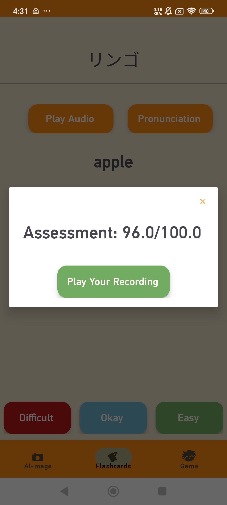
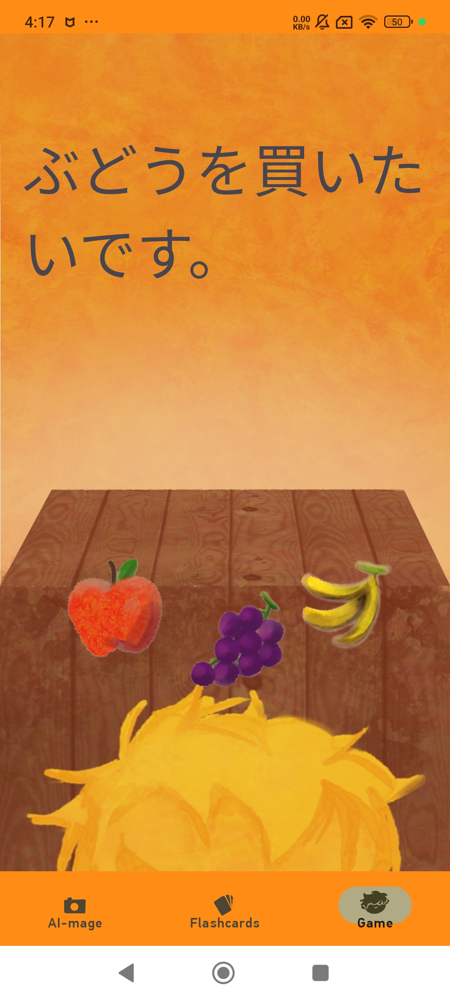

# Glotto

**Glotto** is an Android-based language-learning app that leverages computer vision, cloud speech assessment, vocabulary flashcards and gamification to help users build and retain foreign-language vocabulary and pronunciation skills.

---

## 🚀 Key Features

**Overview video**
https://youtu.be/dUMAY7Z7r4k 

1. **Camera-Based Vocabulary Recognition**  
   - Allows users to take an image of an unknown object in their target language.
   - Calls the **OpenAI Vision REST API** to identify objects in the real world and display their names in the target language.
   
   

2. **Pronunciation Assessment**  
   - Records short audio clips and sends them to the **Microsoft Azure Speech Assessment REST API**.  
   - Provides feedback and a pronunciation score to guide improvement.
   
   

3. **Spaced-Repetition Flashcards**  
   - Displays vocab flashcards in order of decreasing difficulty, based on a retention score.
   - Selecting Easy on a card orders it closer to the bottom of the deck while Difficult orders closer to the top.
   - Persists user progress via retention score in the **Firebase Firestore** .
   
   

4. **Interactive Adventure Game**  
   - A stage-based mini-game, where correct choices unlock new levels and rewards.  
   - Encourages reinforcement of learned words in a playful setting.
   
   

5. **User Authentication & Data Sync**  
   - Secure sign-in via **Firebase Authentication**.  
   - Real-time progress and achievement sync with **Firestore**, so users can switch devices seamlessly.
   

---

## 🛠️ Technology Stack

- **Language & Framework:** Java, Android SDK, AndroidX
- **APIs & Cloud Services:**  
  - OpenAI Vision REST API  
  - Microsoft Azure Speech Assessment REST API  
  - Firebase Auth & Firestore  
- **Networking & Parsing:** OkHttp  

---

## ⚙️ Installation & Running

1. **Simply install Glotto.apk on your android device**  
